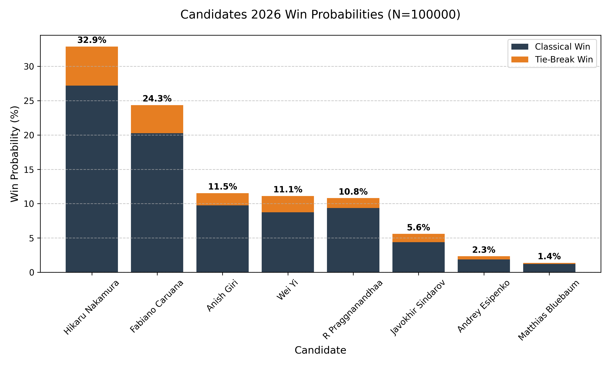
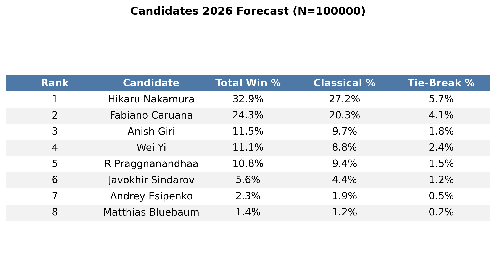

# FIDE Candidates 2026 Monte Carlo Simulation

A probabilistic analysis of the 2026 FIDE Candidates Tournament, utilizing a Monte Carlo simulation ($N=100,000$).

The model can be used with Performance Ratings (TPR) against elite opposition ($>2600$ Elo) from the provided database of games in 2024 and 2025, or updated FIDE ratings using the web scraper. To account for the natural variance in player form, the model samples each player's tournament strength from a normal distribution $N(\mu, \sigma=50)$ at the start of each simulation iteration.

#### Results according to the ratings on 25/1/2026



## Methodology

### Performance Measures
As per research by Chessmetrics, an advantage of 35 Elo is given to the white player. To account for player performance fluctuating between events, we treat a player's strength for a specific tournament iteration as a random variable drawn from a normal distribution.

For each simulation $i$ and player $p$:
$$R_{p,i} \sim \mathcal{N}(\mu_{R}, \sigma^2)$$

Where:
* $\mu_{R}$ is the player's historical TPR against 2600+ opposition (2024-2025), or their updated FIDE rating.
* $\sigma$ is the performance standard deviation (set to $50$ Elo), representing the standard error of performance for a single event.

TPR rating is calculated by adding the average opponent rating to a FIDE rating difference value associated with the fractional score. The draw rate of each player is also calculated from the 2024/2025 2600+ data.

### Win/Draw Probability Model
Game outcomes are simulated using a modified Elo logistic curve that explicitly calculates draw probabilities based on the rating disparity and historical draw rates.

**1. Expected Score ($E_A$):**
$$E_A = \frac{1}{1 + 10^{(R_B - R_A + \gamma)/400}}$$
* Where $\gamma$ is set to $+35$ Elo for White in Classical time controls.

**2. Draw Probability ($P_{draw}$):**
As the rating gap $|R_A - R_B|$ increases, so does the probability of a decisive result. We model the draw probability as a dampened function of the expected score.

$$P_{draw} = \max \left( P_{base} \times (1 - |2E_A - 1|), \quad P_{min} \right)$$

* $P_{base}$: The average draw rate between the two specific players (calculated from players respective data against 2600+ Elo players in 2024 and 2025).
* $P_{min}$: A floor constant ($0.35$) as the minimum probability of a draw.

### Tie-Break Resolution
The simulation implements the FIDE tie-break regulations:
1.  **Stage 1:** Rapid Match (15+10)
2.  **Stage 2:** Blitz Match (3+2)
3.  **Stage 3:** Sudden Death Blitz Bracket

Tie-breaks use live FIDE Rapid and Blitz ratings (scraped from the FIDE website) rather than Classical TPR. For simulating the tournament based on TPRs in 2024 and 2025, the weighted mean ratings for 2025 are used. The white Elo advantage and the draw factor of players is dampened in shorter time control to reflect their increased decisiveness and reduced first-move advantage.

## Project Structure

### Core Programs
| File | Description |
| :--- | :--- |
| `main.py` | Runs the Monte Carlo loop. |
| `calculate_stats.py` | Calculates TPR and draw rates from raw game logs. |
| `scrape_ratings.py` | Fetches updated FIDE Classical, Rapid and Blitz ratings for the candidates. |

### Input Data
| File | Description |
| :--- | :--- |
| `candidates_classical_2024_2025.csv` | Raw dataset of classical games played by the candidates in 2024/2025. |
| `rpd_blz_avg.json` | Rapid and Blitz rating weighted averages for the candidates over 2025. |
| `fide_table.json` | Lookup table for calculating performance ratings. |

### Provided Configuration Files
| File | Description |
| :--- | :--- |
| `current_player_ratings_2026-01-25.json` | The latest Classical, Rapid and Blitz FIDE ratings games against 2600+ Elo opponents, as well as their average 2025 Rapid and Blitz ratings. |
| `candidates_performance_ratings.json` | The TPRs for Classical FIDE rated games against 2600+ Elo opponents', as well as their average 2025 Rapid and Blitz ratings. |

## Set Up
* Python 3.8+
* Dependencies are listed in `requirements.txt`

```bash
pip install -r requirements.txt


