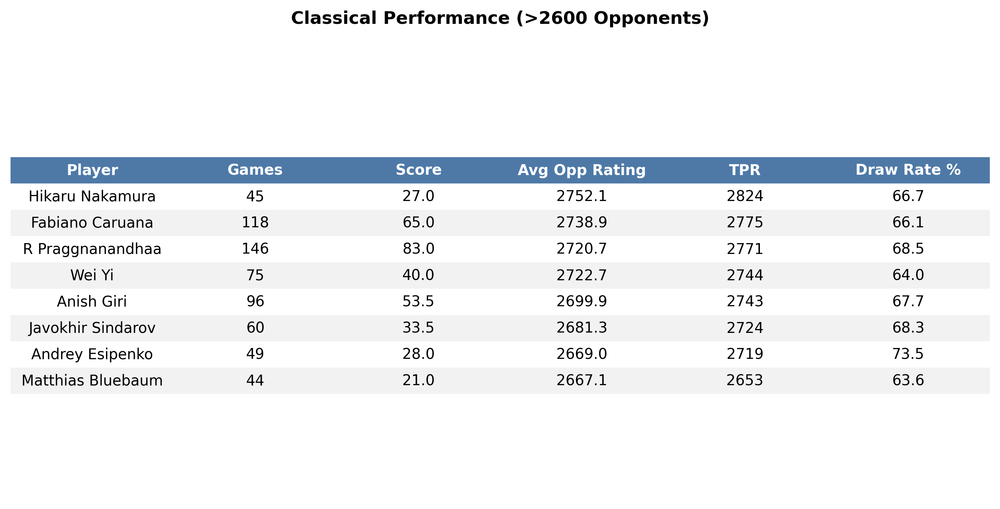

# Candidates Tournament 2026 Monte Carlo Simulation

This Monte Carlo simulation aims to model the probabilities of candidates' victories for the FIDE Candidates Tournament 2026 using Tournament Performance Ratings (TPR) calculated against elite 2600+ Elo players over 2024 and 2025.

The selection of games aims to curb the influence of supposedly inflated Elo and deflated performance ratings caused by games played in open tournaments with significantly lower-rated opposition. TPR is calculated by adding the average opponent rating to a FIDE rating difference value associated with the fractional score.

## Methodology

The probability of a game result is determined using the precomputed TPR of each player, with a bonus of 35 Elo given to the white player as per research by Chessmetrics. The expected score of a game (scored from 0 to 1) is calculated using the formula for expected score ($E_A$), derived from the effective Elo values of White ($R_A$) and Black ($R_B$):

$$E_A = \frac{1}{1 + 10^{(R_B - R_A)/400}}$$

The portion of this score dedicated to a draw is determined by averaging the precomputed draw rates of both players. This rate is then ‘dampened’ based on the expected outcome of the game. Specifically, in an unbalanced game where the expected result nears 100% ($|\text{game result}| \approx 1$), the draw probability approaches 0.

$$\text{draw prob} = \text{base draw} \times (1 - |2 \times E_A - 1|)$$

The probability share of win/draw/loss can then be determined:

$$\text{white win prob} = E_A - \frac{\text{draw prob}}{2}$$

## Tournament simulation

The tournament is simulated based on the [FIDE Candidates 2026 Regulations](https://handbook.fide.com/files/handbook/Regulations_for_the_FIDE_Candidates_Tournament_2026.pdf). This includes:
* A Double Round-Robin tournament (classical time controls).
* A possible 3-part tie-break system consisting of various rapid and blitz matches or round-robin tournaments.

Since some players lack sufficient activity in these short-form variants to compute a statistically significant TPR, average (weighted mean) ratings over the last year are used. Additionally, the white advantage is reduced to 20 and 10 Elo for rapid and blitz respectively, and draw rates are dampened to 0.7 and 0.5 to reflect the increasingly decisive nature of shorter time controls.

With the probability distribution of game outcomes established, the tournament is simulated N = 100,000 times. The results are aggregated to find the total probability of each outcome, including the proportion of victories achieved via the tie-break system.

## Limitations

The simulation relies on static performance metrics and does not dynamically adjust for tournament standing. This means it does not reflect the strategic changes when players are in a 'must win' senario.

## Results

### Classical Performance Data (Input Stats)

